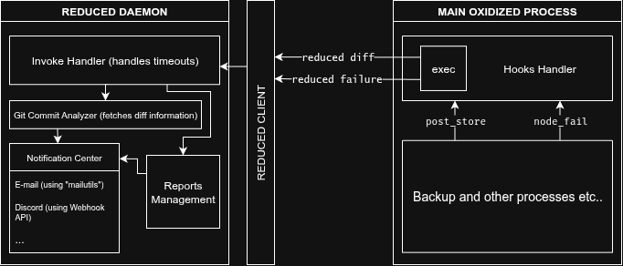

# Reduced -- Specialized Email Notification Utility for Oxidized Network Configuration Management

Reduced is a daemon service that handles mails to be sent out from Oxidized when there are configuration diffs or failures detected on network devices. It ensures that mails are handled concurrently and efficiently, removing autonomous mail activities from Oxidized itself. This gives freedom to user to customize mail handling without affecting Oxidized's core functionalities.

## Architecture

There are two main components in Reduced:

- **Reduced Daemon:** This is the core service that runs in the background, listening for mail requests from Oxidized. It processes these requests and sends out mails accordingly, based on given rules.

- **Reduced Client:** This is a lightweight client that Oxidized uses to communicate with the Reduced Daemon. It sends mail requests to the daemon whenever there is a configuration diff or failure detected.

<div style="text-align: center;">
  
</div>

## Commands for Reduced Daemon

- `reduced-daemon start`: Starts the Reduced daemon.
- `reduced-daemon stop`: Stops the Reduced daemon.
- `reduced-daemon status`: Checks the status of the Reduced daemon.

## Commands for Reduced Client

- `reduced diff`: Sends a diff mail request to the Reduced daemon.
- `reduced failure`: Sends a failure mail request to the Reduced daemon.

## Configuration

Reduced can be configured using a JSON configuration file. Below is an example configuration:

```json
// in ~/.config/oxidized/reduced.json
{
  "diff": {
    "notify": ["mail", "discord"],
    "mail": {
      "recipients": ["admin1@example.com", "admin2@example.com"],
      "cc": [],
      "bcc": []
    },
    "discord": {
      "webhook_id": "YOUR_WEBHOOK_ID",
      "webhook_token": "YOUR_WEBHOOK_TOKEN"
    }
  },
  "failure": {
    "notify": ["mail", "discord"],
    "mail": {
      "recipients": ["admin1@example.com", "admin2@example.com"],
      "cc": [],
      "bcc": []
    },
    "discord": {
      "webhook_id": "YOUR_WEBHOOK_ID",
      "webhook_token": "YOUR_WEBHOOK_TOKEN"
    },
    "timeout": 3600
  },
  "report": {
    "notify": ["mail", "discord"],
    "mail": {
      "recipients": ["admin1@example.com", "admin2@example.com"],
      "cc": [],
      "bcc": []
    },
    "discord": {
      "webhook_id": "YOUR_WEBHOOK_ID",
      "webhook_token": "YOUR_WEBHOOK_TOKEN"
    },
    "interval": 7
  },
  "log": {
    "path": "~/.config/oxidized/reduced.log"
  }
}
```

- `timeout`: Time to lock the mail handling to avoid spamming. This is particularly useful for failure mails to prevent multiple alerts for the same issue. If the command is invoked again within this timeout period, it will be ignored with a warning message but will not crash.
- `path`: Path to the log file where command activations are recorded for transparency and debugging.
- `interval`: Interval in days for generating reports.

## Discord Notifications

Reduced supports sending notifications to Discord webhooks in addition to email. To enable Discord notifications:

1. Create a Discord webhook URL from your Discord server settings
2. Set the `webhook_id` and `webhook_token` in the Reduced configuration file with the values extracted from your webhook URL.

The Discord notifications include:

- **Config Changes**: Green embed with device name, change time, and diff content (truncated if too long)
- **Backup Failures**: Red embed with device details and error information
- **Reports**: Blue embed with activity statistics

All Discord notifications will appear from the "Reduced" username.

## Native Git Integration

Reduced now includes native Git integration that eliminates the need for external scripts. The daemon can directly:

- Fetch configuration diffs from Oxidized's git repositories
- Extract commit information using `OX_REPO_COMMITREF` and `OX_REPO_NAME` environment variables
- Include actual diff content in notifications instead of placeholders
- Handle error cases when commits don't exist

This replaces the previous dependency on external scripts like `oxidized-report-git-commits`.
